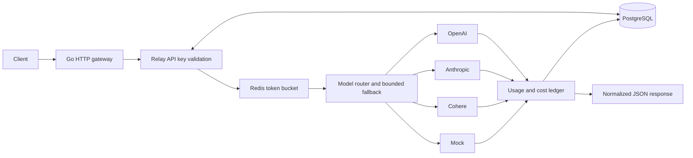

# Relay

[](https://github.com/KennyMx/Relay/actions/workflows/ci.yml)

**One self-hosted API for OpenAI, Anthropic, Cohere, and local mocks.** Relay normalizes text chat requests, routes models, falls back on retryable provider failures, enforces per-key quotas, and records token usage, latency, and estimated cost.

**Go · PostgreSQL · Redis · Docker Compose.** No frontend or external service account is needed. The default routes use deterministic mocks: **$0 in API charges**, with no real provider calls in development, tests, or the demo.



## Quick start

Install Docker with Compose, then:

```sh
git clone https://github.com/KennyMx/Relay.git
cd Relay
docker compose up --build
```

The gateway listens at `http://localhost:8080`. PostgreSQL and Redis stay on the internal Docker network. Migrations run automatically before the gateway starts. No `.env` file is required for the local mock demo.

In another terminal, verify the entire running application:

```sh
docker compose exec -T gateway relay-demo
```

The demo creates a temporary Relay key, exercises success plus 429/500/timeout fallback, checks stored attempts and simulated costs, exhausts the key's quota, and verifies revocation. Expected output includes:

```text
PASS chat           request=<id> attempts=1 tokens=6 simulated_cost=$0.00001000
PASS demo-fallback  request=<id> attempts=2 tokens=6 simulated_cost=$0.00001000
PASS demo-500       request=<id> attempts=2 tokens=6 simulated_cost=$0.00001000
PASS demo-timeout   request=<id> attempts=2 tokens=6 simulated_cost=$0.00001000
PASS per-key quota returns HTTP 429; demo key will now be revoked
```

`docker compose down` stops the stack while retaining the database and Redis volumes. Use `docker compose up -d --wait` to start in the background. Change `RELAY_PORT` in `.env` if port 8080 is occupied.

## API examples

### Create a Relay key

Key administration uses `RELAY_ADMIN_TOKEN`. The following is a **public local-demo credential**, also used by Compose's default configuration:

```sh
export ADMIN_TOKEN=local-demo-admin-token-change-before-sharing
curl -sS http://localhost:8080/v1/keys \
  -H "Authorization: Bearer $ADMIN_TOKEN" \
  -H 'Content-Type: application/json' \
  -d '{"name":"my-demo","requests_per_minute":60,"burst":10}'
```

The response contains `id`, quota settings, creation time, and `api_key`. Copy the returned `api_key` into your shell. **This is the only response that reveals the full key.** PostgreSQL stores its SHA-256 hash; raw Relay keys and provider credentials are never logged.

```sh
export RELAY_KEY='rl_live_<copy-the-returned-key>'
curl -sS http://localhost:8080/v1/chat/completions \
  -H "Authorization: Bearer $RELAY_KEY" \
  -H 'Content-Type: application/json' \
  -d '{"model":"demo-fallback","messages":[{"role":"user","content":"hello world"}],"max_tokens":64}'
```

Representative response (ID and timing vary):

```json
{
  "id": "<request-id>",
  "object": "chat.completion",
  "created": 1789070000,
  "model": "mock-v1",
  "provider": "mock",
  "route": "demo-fallback",
  "choices": [{"index": 0, "message": {"role": "assistant", "content": "Hello from Relay mock."}}],
  "usage": {"input_tokens": 2, "output_tokens": 4, "total_tokens": 6, "simulated": true},
  "cost_nano_usd": 10000,
  "latency_ms": 1,
  "fallback_count": 1
}
```

### Inspect history and revoke a key

```sh
curl -sS 'http://localhost:8080/v1/requests?limit=20&offset=0' \
  -H "Authorization: Bearer $RELAY_KEY"
curl -sS http://localhost:8080/v1/requests/REQUEST_ID \
  -H "Authorization: Bearer $RELAY_KEY"
curl -i -X DELETE http://localhost:8080/v1/keys/KEY_ID \
  -H "Authorization: Bearer $ADMIN_TOKEN"
curl -sS http://localhost:8080/health
```

| Endpoint | Authentication | Behavior |
| --- | --- | --- |
| `POST /v1/chat/completions` | Relay key | Unified text completion; quotas apply |
| `GET /v1/requests` | Relay key | Own request history; `limit` 1–100, `offset` 0–100000 |
| `GET /v1/requests/{id}` | Relay key | Own request metadata and ordered provider attempts |
| `POST /v1/keys` | Admin token | Create key with `requests_per_minute` and `burst` (1–100000) |
| `DELETE /v1/keys/{id}` | Admin token | Revoke key; returns 204, or 404 if missing/already revoked |
| `GET /health` | None | 200 when PostgreSQL and Redis respond; otherwise 503 |

Invalid keys return 401. Revocation affects subsequent authentication checks; already accepted requests may finish. API errors have an `error.code` and `error.message`. Accepted completions carry `X-Request-ID`, including provider failures. History cannot reveal another key's requests.

The API intentionally supports **non-streaming text only**: `system`, `user`, and `assistant` messages, a route alias in `model`, optional `provider`, and `max_tokens` (default 256, maximum 8192). System messages must precede conversation messages, with at least one user message. Unknown fields, including `stream`, are rejected. Bodies are limited to 64 KiB and 100 messages. This is a unified API, not a complete OpenAI API replacement.

## Routing and fallback

Edit [config/relay.json](config/relay.json), then restart the gateway. `model` names a **route alias**, whose ordered targets map to concrete provider models. Omitting it selects `default_route`; the route's first target is the default provider.

| Default route | Attempt sequence |
| --- | --- |
| `chat` | mock success |
| `demo-fallback` | mock 429 → mock success |
| `demo-500` | mock 500 → mock success |
| `demo-timeout` | mock timeout → mock success |
| `demo-error` | mock 500 → HTTP 502, with a failed ledger record |

An explicit `"provider":"mock"` on `demo-fallback` starts at that target, skipping the mock 429. Subsequent targets remain eligible fallbacks. Unknown routes/providers return 400 before consuming quota. Provider names must be unique within a route.

Relay attempts each eligible target **at most once**, bounded by `max_attempts` (1–5). It tries the next target after **429, 500, 502, 503, 504, or timeout**. Authentication and other non-retryable failures stop immediately. There is no same-provider retry loop or background retry. Overall and per-attempt deadlines are configurable; caller cancellation stops further attempts. Fallback switches to a different target immediately, so it does not sleep for the failed provider's `Retry-After`.

For a real route, the same client request can follow OpenAI 429 → Anthropic success. The response identifies the provider and model that actually completed it. All attempted targets, including failures, appear in request detail.

## Real provider configuration (optional)

Real calls may incur provider charges. The repository's tests use local HTTP fixtures for all three adapters; no live provider credentials were used to verify them.

1. Copy `.env.example` to `.env`, set the desired provider API keys, and replace the public local admin token. Keep `.env` untracked.
2. Use [config/real.example.json](config/real.example.json) as a template for `config/relay.json`. Replace **all model placeholders and illustrative prices** with models available to your account and their current rates. Remove unused providers/targets and their prices.
3. Recreate the gateway with `docker compose up --build -d --wait` so environment changes take effect.

| Adapter | Environment variable | Wire API and usage |
| --- | --- | --- |
| OpenAI | `OPENAI_API_KEY` | [Chat Completions](https://platform.openai.com/docs/api-reference/chat/create); prompt/completion tokens |
| Anthropic | `ANTHROPIC_API_KEY` | [Messages](https://platform.claude.com/docs/en/api/http/messages/create); input/output tokens; system messages moved to top-level `system` |
| Cohere | `COHERE_API_KEY` | [Chat v2](https://docs.cohere.com/v2/reference/chat); `usage.billed_units` input/output counts |

Configured real providers require their credentials at startup. Endpoints are fixed to provider HTTPS origins; redirects are not followed. The client never supplies provider credentials or endpoint URLs. Missing/invalid upstream usage is treated as an invalid response, rather than falsely reporting a free completion.

## Quotas, ledger, and cost tracking

**Redis token bucket.** Each Relay key has an initial `burst` of request tokens. Tokens refill continuously at `requests_per_minute / 60`, capped at `burst`. One accepted chat call consumes one token, regardless of its fallback count. A Lua script uses Redis server time to atomically refill and consume, including across concurrent gateway instances. Idle buckets expire after a full refill interval. Exhaustion returns 429 with `Retry-After` and `X-RateLimit-Remaining`; Redis failure returns 503 and prevents upstream work. This is a request quota, not an LLM-token or billing limit. Redis uses AOF persistence; abrupt failures can lose its most recent unflushed quota updates.

**PostgreSQL ledger.** Numbered, embedded SQL migrations run under a transaction and advisory lock. Before upstream work, Relay inserts a `pending` request. It then atomically finalizes request metadata and individual attempts: provider/model, timestamp, input/output/total tokens, latency, estimated cost, status, sanitized error code, and fallback count. Prompts, completions, and upstream error bodies are not stored. Auth failures, invalid requests, and quota rejections do not create provider ledger entries.

Finalization has a separate three-second deadline, so client cancellation still allows audit persistence. If saving fails, Relay returns 503 rather than claiming a recorded success. A process crash can leave `pending` rows; there is no recovery worker. PostgreSQL and Redis data persist in named Docker volumes.

**Live cost estimates.** The response and ledger expose `cost_nano_usd`, calculated from each successful attempt's reported usage and configured per-token prices:

```text
cost_nano_usd = input_tokens × input_rate + output_tokens × output_rate
USD = cost_nano_usd / 1,000,000,000
```

For example, $0.15 per million input tokens is **150 nano-USD per input token**. Prices must exist for every target; missing prices fail startup. Integer arithmetic avoids floating-point rounding. Cohere counts billed units, which can differ from raw token counts.

Mock input usage is the count of whitespace-separated words; its fixed four-word output is truncated by `max_tokens`. Both response and ledger mark this as `simulated: true`. Mock prices are illustrative: the example's $0.00001000 estimate is **not an actual charge**.

These are estimates, not invoice reconciliation. Failed/timed-out attempts have zero *known* usage and cost; an upstream provider might still bill work that Relay could not observe. Cached-token discounts, reasoning-specific pricing, and other billing adjustments are outside this text-only implementation.

Inspect the persisted evidence directly:

```sh
docker compose exec postgres psql -U relay -d relay -c \
  'SELECT id, provider, model, total_tokens, simulated, latency_ms, cost_nano_usd, status, fallback_count FROM requests ORDER BY created_at DESC LIMIT 10;'
docker compose exec postgres psql -U relay -d relay -c \
  'SELECT request_id, number, provider, status, error_code, latency_ms FROM provider_attempts ORDER BY started_at DESC LIMIT 10;'
```

## Testing and local development

Docker-only integration tests run **real PostgreSQL and Redis**, including atomic concurrent quotas, refill, key validation/revocation, transaction rollback, request isolation, deadlines, and all mock routes:

```sh
docker compose -f docker-compose.yml -f docker-compose.test.yml run --rm test
```

This runs `go test -race -count=1 ./...` and `go vet ./...`. Tests create and clean up their own records and bucket keys; no database flush is used. GitHub Actions builds Compose, runs this suite, and verifies the live API with `relay-demo`.

With Go 1.23+ installed (Docker and CI use Go 1.25):

```sh
make test       # Unit tests; service integration tests explicitly skip
make check      # go vet and formatting
make integration
make demo      # Against the running Compose gateway
```

To run the gateway outside Docker, provide reachable `DATABASE_URL`, `REDIS_URL`, and a `RELAY_ADMIN_TOKEN` of at least 32 characters, then `go run ./cmd/relay`. Compose does not publish database/cache ports. `RELAY_CONFIG` defaults to `config/relay.json`, and `RELAY_ADDR` to `:8080`. For integration tests against your own services, set `RELAY_INTEGRATION=1` along with those database/cache URLs and run `go test -race ./...`.

The local Compose credentials are intentionally public examples, and the HTTP port binds to loopback. For use beyond your own machine, replace those credentials and provide TLS at your network boundary. There is no hosted infrastructure or deployment requirement.

## Code map

- `cmd/relay`: startup, dependency checks, migrations, graceful shutdown.
- `cmd/demo`: executable end-to-end portfolio verification.
- `internal/provider`: shared interface, four adapters, local HTTP fixture tests.
- `internal/router`: target selection, deadlines, bounded fallback.
- `internal/ratelimit`, `internal/keys`, `internal/pricing`: quota and credential/cost logic.
- `internal/api`, `internal/store`, `migrations`: HTTP API and durable audit trail.

Licensed under [MIT](LICENSE).
