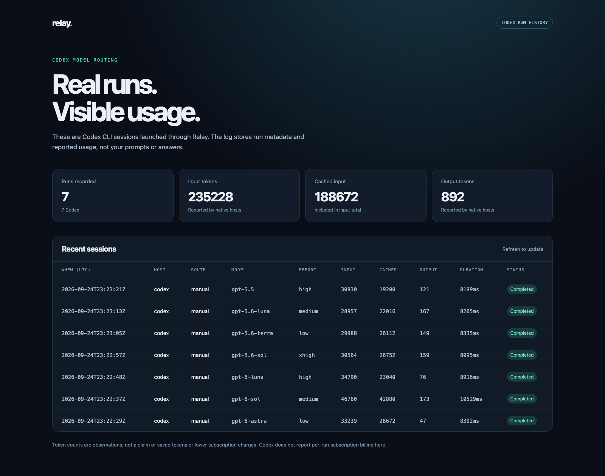
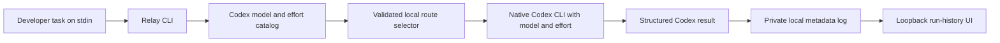

# Relay

[](https://github.com/KennyMx/Relay/actions/workflows/ci.yml) [](go.mod) [](LICENSE)

**Route a real Codex CLI task to any available model and reasoning level, and see the usage Codex actually reports.** Relay is a small Go launcher that starts a native Codex run, captures its structured token counts, and keeps a local run history. It uses your existing Codex login; the primary workflow needs no provider API key, Docker stack, or simulated completion.

[Product site](https://relay-three-iota.vercel.app) · [Architecture](https://relay-three-iota.vercel.app/architecture) · [Source](https://github.com/KennyMx/Relay)



The screenshot shows seven **real, read-only Codex CLI runs** through Relay on September 24, 2026, one per model available to the test account. The public site is documentation; the run-history page serves your own data locally at `127.0.0.1:8787`.

## Quick start

Install [Go 1.26+](https://go.dev/doc/install) and the [Codex CLI](https://developers.openai.com/codex/cli). Sign in to Codex through its normal flow, then:

```sh
git clone https://github.com/KennyMx/Relay.git
cd Relay
go install ./cmd/relay-agent
export PATH="$(go env GOPATH)/bin:$PATH"

relay-agent models  # Discover your available models and reasoning levels

printf 'Find the Go package that implements the Redis token bucket.' |
  relay-agent run --host codex --mode cheap

relay-agent runs
relay-agent serve
```

Open [http://127.0.0.1:8787](http://127.0.0.1:8787) to view your run history. Relay stores model, host, route, duration, status, and reported usage in an ignored `.relay/runs.jsonl` file. It does **not** store prompts or answers. The UI binds to loopback only. Use `--log PATH` on `run`, `runs`, and `serve` to keep the log elsewhere.

By default the native Codex run is read-only. Add `--write` to use Codex's workspace-write mode with automatic approval review for actions that need it. Relay never bypasses those controls.

## Model and reasoning routing

Relay discovers picker-visible models through Codex's [`model/list`](https://learn.chatgpt.com/docs/app-server#list-models-modellist) API. It validates model and effort together before launching `codex exec --model ID -c 'model_reasoning_effort="LEVEL"'`. Availability comes from your installed CLI and account, so new catalog models can be selected without a Relay release.

| Selection | Behavior |
| --- | --- |
| `--mode auto` (default) | Local rules choose simple → Luna/low, standard → Sol/medium, complex → Astra/high. |
| `--mode cheap` / `--mode strong` | Select the configured simple / complex route directly. |
| `--model ID` | Override the route with any model in your current Codex catalog. |
| `--effort LEVEL` | Override the selected route's reasoning level; unsupported pairs fail before running. |
| `--routing PATH` | Map each of the three complexity tiers to your own model and effort. |
| `--dry-run` | Discover the catalog and print the validated choice without starting a model run. |

```sh
# Explicit older model with extra-high reasoning:
printf 'Review the rate limiter for race conditions.' |
  relay-agent run --model gpt-5.6-terra --effort xhigh

# Preview automatic routing with your own model/effort mapping:
printf 'Explain the rate limiter.' |
  relay-agent run --routing config/codex-routing.example.json --dry-run
```

`relay-agent models` prints the catalog as JSON, including supported and default efforts. `light` is accepted as an alias for `low`, and `extra-high` / `extrahigh` for `xhigh`. An explicit `--model` uses that model's advertised default effort unless you override it. Automatic routes have their own effort settings. Levels such as `max` and `ultra` are accepted only when advertised for the selected model.

The [routing file](config/codex-routing.example.json) can use **any catalog model** for each tier, including GPT-5.6 and GPT-5.5. Automatic selection chooses among those three configured routes; it does not rank the entire catalog by price. When a built-in preferred model is absent, Relay uses the catalog's recommended default and reports the selected model. Explicit choices and routing files never silently substitute another model.

The offline heuristic marks explanation/debugging tasks as standard and architecture/concurrency tasks as complex. It is a simple baseline, not a learned quality predictor or a cost optimizer. Jev remains optional for the separate [HTTP gateway](docs/automatic-routing.md); native Codex routing makes no classification API call. `--cheap-model` and `--strong-model` remain compatibility overrides for the simple and complex routes.

## Verified real runs

On September 24, 2026, the opt-in integration test discovered all seven models below and ran this exact repository question through each: “Read the repository and identify the Go package implementing Relay's Redis token bucket. Respond only with its repository-relative directory path.” **All seven returned `internal/ratelimit`.** The selected model and effort were passed to Codex; token counts came from its `turn.completed` events.

| Model | Effort tested | Input tokens | Cached input¹ | Output tokens | Wall time | Check |
| --- | --- | ---: | ---: | ---: | ---: | --- |
| `gpt-6-astra` | `low` | 33,239 | 28,672 | 47 | 8.39 s | Pass |
| `gpt-6-sol` | `medium` | 46,760 | 42,880 | 173 | 10.53 s | Pass |
| `gpt-6-luna` | `high` | 34,790 | 23,040 | 76 | 8.92 s | Pass |
| `gpt-5.6-sol` | `xhigh` | 30,564 | 26,752 | 159 | 8.10 s | Pass |
| `gpt-5.6-terra` | `low` | 29,988 | 26,112 | 149 | 8.34 s | Pass |
| `gpt-5.6-luna` | `medium` | 28,957 | 22,016 | 167 | 8.21 s | Pass |
| `gpt-5.5` | `high` | 30,930 | 19,200 | 121 | 8.20 s | Pass |

¹ Cached input is included in input tokens. [Inspect the catalog, answers, and usage receipts](docs/verification/codex-models-2026-09-24.json). This is an execution check of seven model/effort pairs, not an exhaustive test of every effort or a quality/savings benchmark. Catalogs and account availability can change. Codex's JSON stream does not independently echo the serving model or reasoning effort; receipts label these as requested settings, not backend attestation.

The installed plugin was also invoked from a real Codex host: `list_codex_models` succeeded, then `route_codex_task` ran **GPT-5.6 Terra / xhigh** and returned the same correct package. That child reported **45,913 input** (40,192 cached), **322 output tokens**, and **15.23 s**. [Inspect the plugin call and receipt](docs/verification/codex-plugin-2026-09-24.json). The child’s usage excludes the parent task’s additional overhead.

Reproduce the real check with your own authenticated Codex CLI (this consumes normal Codex account usage):

```sh
RELAY_LIVE_CODEX=1 go test ./cmd/relay-agent -run '^TestLiveCodexCatalog$' -count=1 -v
```

The test is skipped by ordinary `go test` and CI. It discovers models dynamically, exercises supported low/medium/high/xhigh levels, and checks the answer and nonzero reported usage. No provider API keys are required. Context and caching differ between runs; **these numbers do not establish monetary or subscription savings**. Routing can choose a lighter model/effort, but the Codex CLI does not expose a per-run subscription bill.

## Architecture



Relay passes the task to the native CLI, so Codex retains its own authentication, tool execution, and approval system. The launcher parses the final answer and reported usage, then appends one metadata record. Failed runs are recorded with status and any usage received. The local UI reads the log on refresh; it makes no provider calls.

## Codex plugin

The [Codex plugin](plugins/relay) exposes `route_codex_task` so a running Codex task can send one bounded, read-only subtask to a selected Codex model and receive the native usage receipt. It uses the same local run log and requires no Relay key or provider API key. Its `list_codex_models` tool exposes the available models and effort levels. The [plugin guide](docs/agent-plugin.md) covers setup and the extra startup/context overhead of a nested agent. For a new task, the CLI launcher above is simpler.

### Can Relay appear in the Codex model dropdown?

The documented [plugin interface](https://developers.openai.com/plugins/concepts/plugins) exposes skills, tools, and hooks; it does not provide a model-picker extension or a way to transparently replace all chat inference. Installing Relay therefore **does not add a Relay model entry or automatically route every message**. Use the plugin for an explicitly requested subtask, or the CLI for a whole new task. The parent Codex session retains its own model.

Example in Codex: “Use Relay to inspect the rate limiter with GPT-5.6 Terra at extra-high reasoning and show the usage receipt.”

## Optional API gateway

The repository also contains Relay's earlier self-hosted Go API gateway. It provides a normalized `/v1/chat/completions` endpoint for OpenAI, Anthropic, and Cohere, with provider fallback, Redis per-key quotas, and a PostgreSQL usage ledger. It can be started with `docker compose up --build`; real provider calls require your own keys and may cost money. See [gateway operations](docs/operations.md), [configuration](config/real.example.json), and [security](SECURITY.md). A mock adapter remains available as a test fixture, but the public site no longer offers a simulated request playground.

The MCP server retains an advanced gateway-delegation tool, but the default Codex skill uses the native Codex route. An MCP tool cannot transparently change the parent Codex session's model. Experimental Claude Code command and result parsing exist in the CLI, but the **verified integration in this release is Codex**.

## Test

```sh
go test ./...
go vet ./...
node --test internal/webui/*test.cjs
docker compose -f docker-compose.yml -f docker-compose.test.yml run --rm test
```

The focused launcher tests cover model selection, structured result parsing, private run logging, and the local UI. The Docker target covers the separate PostgreSQL/Redis gateway. No paid completion API calls are needed to run tests. To verify live native routing, use your authenticated Codex CLI as shown above.

Licensed under [MIT](LICENSE).
