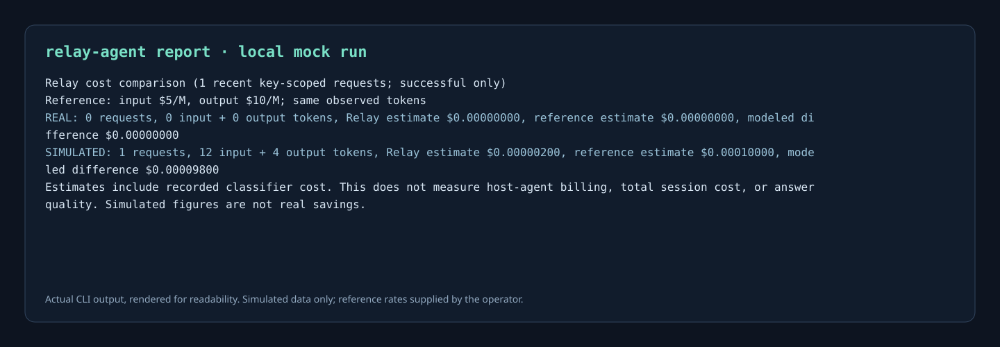
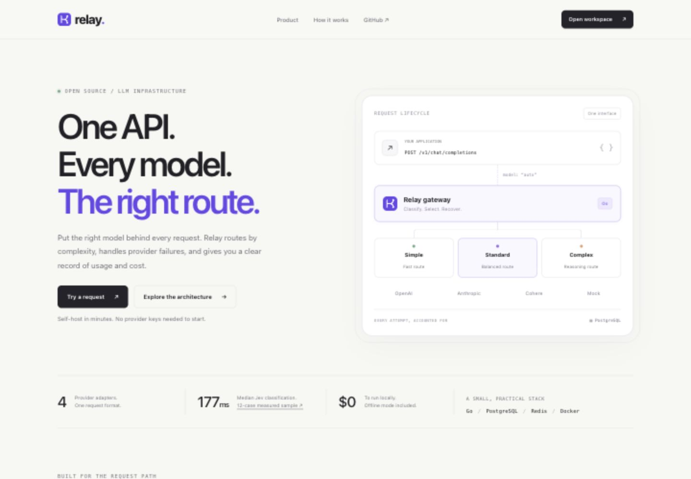
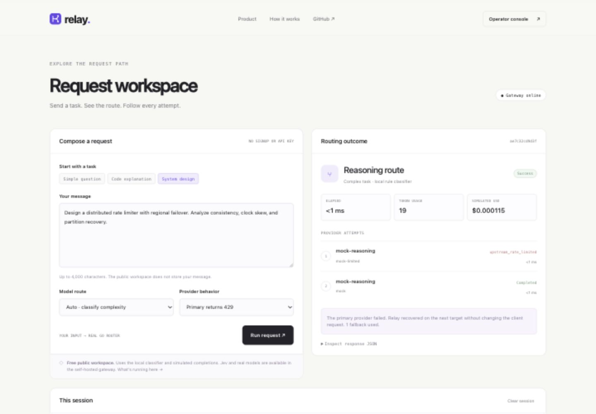
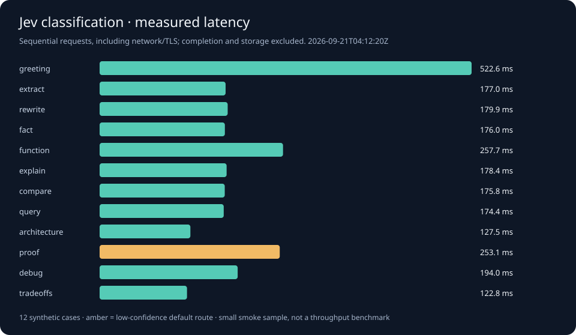
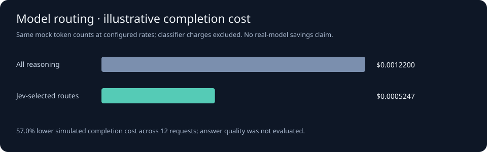
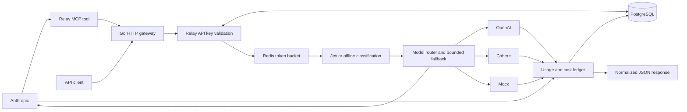

# Relay

[](https://github.com/KennyMx/Relay/actions/workflows/ci.yml)
[](go.mod)
[](LICENSE)

**Route bounded coding-agent tasks to a model you choose, then inspect the cost of each call.** Relay is an opt-in MCP plugin for Codex and Claude Code backed by a self-hosted Go gateway. The agent can delegate a small text task to a configured lower-cost route; Relay returns the answer, provider, token usage, estimated cost, and request ID. PostgreSQL records every attempt, Redis enforces per-key quotas, and the same gateway also serves a normalized `/v1/chat/completions` API for OpenAI, Anthropic, Cohere, and a free mock provider.

Relay does **not** change Codex's or Claude Code's main model. Its value is selective delegation and transparent accounting. Routing to a cheaper model may lower spend on those calls, but it does not guarantee fewer tokens or lower total session cost.

**[Live site](https://relay-three-iota.vercel.app) · [Try a request](https://relay-three-iota.vercel.app/workspace) · [Explore the architecture](https://relay-three-iota.vercel.app/architecture)**

**[Install the coding-agent plugin](docs/agent-plugin.md)** · [MCP server and tests](cmd/relay-agent) · [Plugin source](plugins/relay)

## Use it as a developer tool

1. [Start the local stack](#quick-start) and create a Relay key in the operator console. The default `chat` route uses the mock provider, so setup and testing cost $0.
2. `go install ./cmd/relay-agent`, export `RELAY_KEY` privately, and run `relay-agent check`. Load the [Codex or Claude Code plugin](docs/agent-plugin.md); it starts the `relay-agent mcp` server automatically.
3. Ask the agent to use `relay:cheap-task` for a small standalone task. The `relay.delegate_task` MCP tool sends only that task through Relay and returns a per-call receipt. For real answers, [configure your own lower-cost model](#use-your-own-provider) on the route.
4. Run `relay-agent report --reference-input 5 --reference-output 10` with **your chosen reference model's prices** to compare the same observed tokens at two prices. Real and simulated calls are reported separately.

The mock-path receipt from a local end-to-end run:

```text
Relay: mock/mock-fast, route=fast, input=12, output=4,
estimated=$0.00000200, simulated=true
```

The [reporting method and sample output](docs/agent-plugin.md#inspect-modeled-cost-difference) explain what that comparison can and cannot establish. The local mock result is a verification of accounting, not a claim of real savings. Jev classification is optional; a fixed cheap route is preferable for obvious small tasks because classification itself has cost and latency.



The image renders actual CLI output from one local mock request. Its reference rates are illustrative operator inputs; no real-provider savings were measured.



### Try the request path

Open the [public workspace](https://relay-three-iota.vercel.app/workspace), choose **System design**, set **Primary returns 429**, and run the request. Relay classifies the task, shows the selected route, then records the failed primary attempt and successful fallback. The workspace runs the actual Go router with simulated completions and cost estimates, so it needs no signup or paid API keys. The full PostgreSQL and Redis gateway runs locally with Docker Compose.



## What you can verify

| Capability | Implementation | Evidence |
| --- | --- | --- |
| Automatic model selection | Local classifier by default; optional Jev with a confidence threshold and bounded deadline | [Classification tests](internal/classifier/jev_test.go) · [Routing tests](internal/router/automatic_test.go) |
| Provider independence | One Go interface; OpenAI, Anthropic, Cohere, mock adapters | [Adapter fixture tests](internal/provider/http_test.go) |
| Partial-failure handling | Per-attempt deadlines, cancellation, bounded ordered fallback | [Router tests](internal/router/router_test.go) |
| Shared quotas | Atomic Redis Lua token bucket using server time | [Concurrent Redis tests](internal/ratelimit/bucket_test.go) |
| Durable request history | Pending record before upstream work; transactional attempt finalization | [Ledger tests](internal/store/store_test.go) |
| Access isolation | Hashed keys, revocation, history scoped to the authenticated key | [HTTP tests](internal/api/api_test.go) |
| Cost accounting | Integer nano-USD arithmetic; simulated usage explicitly labeled | [Pricing tests](internal/pricing/pricing_test.go) |

## Quick start

Install Docker with Compose, then:

```sh
git clone https://github.com/KennyMx/Relay.git
cd Relay
docker compose run --rm --build --no-deps --user "$(id -u):$(id -g)" -v "$PWD:/setup" gateway init /setup/.env
docker compose up --build
```

The website is available at [http://localhost:8080](http://localhost:8080); open the [operator console](http://localhost:8080/console) to manage the gateway. PostgreSQL and Redis stay on the internal Docker network. Migrations run automatically before the gateway starts. The one-time `init` command creates an ignored `.env` file with unique random admin/database credentials and owner-only permissions. It refuses to replace an existing file. On Windows, omit the `--user` option and mount the repository's absolute path at `/setup`.

Open your local `.env` privately, copy `RELAY_ADMIN_TOKEN`, and select **Create key** in the console. There is no shared admin password. The console reveals the raw Relay key once, then keeps it only in memory. Disconnecting or reloading requires reconnection with your saved key; it is not written to browser storage. Disconnect also clears prompts and request data from the page.

Verify the running service with one command:

```sh
docker compose exec -T gateway relay-verify
```

This exercises successful requests, 429/500/timeout fallback, durable attempt records, per-key quotas, and revocation. The shipped `local` classifier and mock completion routes run without credentials or API charges. Jev is an explicit opt-in external service; see [setup and policy](docs/automatic-routing.md).

`docker compose down` stops services and retains data. Set `RELAY_PORT` in `.env` if port 8080 is occupied.

## Use your own provider

The default setup is free and uses mock completions. For actual text-chat requests, edit your private `.env` and set `RELAY_MODE=real`. Choose one provider (`openai`, `anthropic`, or `cohere`), a model ID available to your account, and that model's current input/output prices in **USD per million tokens**:

```dotenv
RELAY_MODE=real
RELAY_PRIMARY_PROVIDER=openai
RELAY_PRIMARY_MODEL=<your-model-id>
RELAY_PRIMARY_INPUT_USD_PER_M=<current-input-price>
RELAY_PRIMARY_OUTPUT_USD_PER_M=<current-output-price>
OPENAI_API_KEY=<your-private-key>
```

Optionally set `RELAY_FALLBACK_PROVIDER`, `RELAY_FALLBACK_MODEL`, `RELAY_FALLBACK_INPUT_USD_PER_M`, `RELAY_FALLBACK_OUTPUT_USD_PER_M`, and that second provider's API key. The providers must differ. Recreate with `docker compose up --build -d --wait`, then send the [same request](#use-the-api) using `model: "chat"` or omit `model`. The gateway tries the fallback once for retryable failures and records both attempts. Your own provider account may incur charges. Verify current model IDs and prices with [OpenAI](https://developers.openai.com/api/docs/pricing), [Anthropic](https://platform.claude.com/docs/en/about-claude/pricing), or [Cohere](https://docs.cohere.com/docs/how-does-cohere-pricing-work). Relay's estimates use the prices you enter; they are not provider invoices.

This small setup gives you one stable API, per-key quotas, usage history, and fallback for real calls. The advanced [JSON configuration](config/real.example.json) still supports multiple routes and automatic complexity routing. The public workspace stays simulated and never receives your provider keys. See [operations](docs/operations.md#real-provider-configuration-optional) for details.

## Use Relay from Codex or Claude Code

The [Relay plugin](plugins/relay) provides an MCP `delegate_task` tool and an opt-in `cheap-task` skill. It sends a small, self-contained text task to your self-hosted gateway's `chat` route and returns the answer with a request ID, token counts, and estimated cost. Configure that route with a lower-cost model and keep expensive models out of its fallback order. The host agent handles edits, tool calls, and final checks.

The `relay-agent` CLI and MCP server read the Relay key from `RELAY_KEY`, limit each task to 8 KiB and requested output to 512 tokens, and never call a provider during `check`. Install it with `go install ./cmd/relay-agent`, then follow the [plugin setup and usage guide](docs/agent-plugin.md). The default mock gateway lets you try the workflow for $0; real delegation uses your provider account and may incur charges. `relay-agent report` compares observed usage with a user-supplied reference price and labels mock data separately.

## Request workspace and operator console

`/workspace` is the public, credential-free request tool. It shows routing decisions, ordered attempts, latency, simulated usage and cost, and raw JSON. Its latest 20 requests stay only in browser memory; clearing the session also cancels in-flight work.

`/console` operates your self-hosted gateway with a Relay API key. The console uses the actual gateway API and stored request data. Create a key, choose a route, send a completion, then inspect the ordered attempts and raw ledger JSON. History is paginated; summary cards describe the current page. Provider cost estimates and simulated costs are shown separately.

## Jev routing, measured

The 12-case smoke evaluation returned valid Jev classifications for **12/12 requests**, with **177 ms median** and **523 ms p95** wall time. Final routes matched the manually assigned reference tiers on **11/12 cases**; one low-confidence result selected the default route. This is a small synthetic sample, not a general accuracy or throughput claim.





[Inputs](docs/benchmarks/cases.json) · [Live Jev results](docs/benchmarks/jev.json) · [Offline baseline](docs/benchmarks/local.json) · [Methodology and reproduction](docs/automatic-routing.md#reproduce-the-evaluation)

To enable Jev, privately set `JEV_API_KEY` and `RELAY_CLASSIFIER=jev` in `.env`, then recreate the gateway. Jev receives the messages and can consume credits. Completion costs and classification costs are recorded separately. The default local setup remains free.

## Architecture



The gateway validates access and claims one quota token before attempting upstream work. PostgreSQL and Redis are shared state; gateway instances do not keep a private quota counter. If either dependency is unavailable, Relay prevents upstream work. A separate finalization deadline lets the gateway record attempts even after a client disconnects.

Read [the design decisions and failure boundaries](docs/design.md) for tradeoffs, including why retries cannot guarantee exactly-once provider billing.

## Use the API

After creating a key, save it locally as `RELAY_KEY`:

```sh
curl -sS http://localhost:8080/v1/chat/completions \
  -H "Authorization: Bearer $RELAY_KEY" \
  -H 'Content-Type: application/json' \
  -d '{"model":"auto","messages":[{"role":"user","content":"hello world"}],"max_tokens":64}'
```

For a fallback example, change `model` to `fallback-rate-limit`: the configured primary returns 429, Relay tries the secondary, and the normalized completion contains `fallback_count: 1`. Inspect its request ID in the console or `GET /v1/requests/{id}` to see both attempts. Default mock routes also cover 500, timeout, and complete provider failure.

[API contract (OpenAPI)](docs/openapi.json) · [API examples and operations](docs/operations.md) · [Routing configuration](config/relay.json) · [Real-provider template](config/real.example.json)

Real completion providers are optional and require your own credentials and current model pricing. The Jev adapter has also been verified against the live official API with the recorded synthetic corpus. Completion adapters are tested against local HTTP fixtures; **no paid provider calls are required for development or testing**.

## Test

```sh
# Real PostgreSQL + Redis; race detector and go vet
docker compose -f docker-compose.yml -f docker-compose.test.yml run --rm test

# UI behavior and credential lifecycle (Node is test tooling only)
node --test internal/webui/*test.cjs
```

GitHub Actions runs these checks, live service verification, dependency/static security checks, and a full-history secret scan. With Go installed, `make test` runs unit tests; service tests explicitly skip unless integration mode is enabled.

## Vercel deployment

The public site runs a dedicated Go entrypoint, `cmd/server`, with no external provider credentials or database dependency. The full authenticated gateway remains self-hostable with Docker. See [deployment instructions and runtime boundaries](docs/deployment.md).

## Scope

Relay supports non-streaming text chat, not the complete provider API surface. It does not store prompts or completions, implement accounts or payments, or provide exactly-once upstream execution. Costs are estimates: timed-out providers may still bill work, and process crashes can leave pending ledger rows. Real-provider model names and prices must be configured by the operator.

The default HTTP binding is loopback. For network exposure, configure allowed hosts and a TLS reverse proxy. See [security and credential rotation](SECURITY.md).

Licensed under [MIT](LICENSE).
