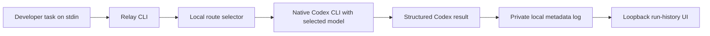

# Relay

[](https://github.com/KennyMx/Relay/actions/workflows/ci.yml) [](go.mod) [](LICENSE)

**Route a real Codex CLI task to a selected model and see the usage Codex actually reports.** Relay is a small Go launcher that starts a native Codex run, captures its structured token counts, and keeps a local run history. It uses your existing Codex login; the primary workflow needs no provider API key, Docker stack, or simulated completion.

[Product site](https://relay-three-iota.vercel.app) · [Architecture](https://relay-three-iota.vercel.app/architecture) · [Source](https://github.com/KennyMx/Relay)


The screenshot shows three **real, read-only Codex CLI runs** launched through Relay on September 24, 2026: two direct CLI runs and one child invoked through the installed Codex plugin. The public site is product documentation; the run-history UI serves your own data locally at `127.0.0.1:8787`.

## Quick start

Install [Go 1.26+](https://go.dev/doc/install) and the [Codex CLI](https://developers.openai.com/codex/cli). Sign in to Codex through its normal flow, then:

```sh
git clone https://github.com/KennyMx/Relay.git
cd Relay
go install ./cmd/relay-agent
export PATH="$(go env GOPATH)/bin:$PATH"

printf 'Find the Go package that implements the Redis token bucket.' |
  relay-agent run --host codex --mode cheap

relay-agent runs
relay-agent serve
```

Open [http://127.0.0.1:8787](http://127.0.0.1:8787) to view your run history. Relay stores model, host, route, duration, status, and reported usage in an ignored `.relay/runs.jsonl` file. It does **not** store prompts or answers. The UI binds to loopback only. Use `--log PATH` on `run`, `runs`, and `serve` to keep the log elsewhere.

By default the native Codex run is read-only. Add `--write` to use Codex's workspace-write mode with automatic approval review for actions that need it. Relay never bypasses those controls.

## Model routing

Relay chooses the model **before** a new Codex run starts. It cannot switch the model of an existing Codex conversation or intercept its internal model calls.

| Mode | Selection |
| --- | --- |
| `--mode cheap` | Use the cheap model directly. |
| `--mode strong` | Use the strong model directly. |
| `--mode auto` | Use an offline complexity rule; complex tasks go to strong, other tasks to cheap. |

The default Codex model names are `gpt-6-luna` and `gpt-6-sol`. They can be overridden with `--cheap-model` and `--strong-model` according to models available to your account:

```sh
printf 'Review the concurrency behavior in this package.' |
  relay-agent run --host codex --mode auto \
    --cheap-model gpt-6-luna --strong-model gpt-6-sol
```

The local rule is deliberately simple and costs no classification API call. It is not a quality guarantee. Relay retains an optional Jev classifier for its separate HTTP gateway, but Jev is **not** needed for native Codex routing: it would send task text to another service and add latency and possible cost. See [gateway routing](docs/automatic-routing.md) if you need that path.

## Measured Codex run

I ran the same read-only repository question through both modes from this checkout: “Find the Go package that implements Relay's Redis token bucket and state its path in one sentence.” Both answered `internal/ratelimit`. Relay parsed these values from Codex's `turn.completed` JSON events:

| Selected model | Input tokens | Cached input | Output tokens | Wall time |
| --- | ---: | ---: | ---: | ---: |
| `gpt-6-luna` | 31,282 | 26,112 | 124 | 8.3 s |
| `gpt-6-sol` | 47,119 | 43,136 | 221 | 10.7 s |

I also installed the plugin and invoked `route_codex_task` from a parent Codex task. It launched a read-only Luna child, which answered the same package question. The child reported **53,596 input tokens** (44,288 cached), **334 output tokens**, and **12.5 s** wall time. This verifies the plugin-to-Codex path, including the added context overhead of a nested agent.

The direct comparison is a **two-run integration check**, not a savings benchmark. Codex's context and cache state can differ between runs, and this CLI output does not provide a per-run subscription bill. Relay reports the observed token counts and the chosen model; it does not claim that all tasks use fewer tokens or cost less. Reproduce it with the quick-start command and inspect your own receipt and local UI.

## Architecture



Relay passes the task to the native CLI, so Codex retains its own authentication, tool execution, and approval system. The launcher parses the final answer and reported usage, then appends one metadata record. Failed runs are recorded with status and any usage received. The local UI reads the log on refresh; it makes no provider calls.

## Codex plugin

The [Codex plugin](plugins/relay) exposes `route_codex_task` so a running Codex task can send one bounded, read-only subtask to a selected Codex model and receive the native usage receipt. It uses the same local run log and requires no Relay key or provider API key. The [plugin guide](docs/agent-plugin.md) covers setup and the extra startup/context overhead of a nested agent. For a new task, the CLI launcher above is simpler.

## Optional API gateway

The repository also contains Relay's earlier self-hosted Go API gateway. It provides a normalized `/v1/chat/completions` endpoint for OpenAI, Anthropic, and Cohere, with provider fallback, Redis per-key quotas, and a PostgreSQL usage ledger. It can be started with `docker compose up --build`; real provider calls require your own keys and may cost money. See [gateway operations](docs/operations.md), [configuration](config/real.example.json), and [security](SECURITY.md). A mock adapter remains available as a test fixture, but the public site no longer offers a simulated request playground.

The MCP server retains an advanced gateway-delegation tool, but the default Codex skill uses the native Codex route. An MCP tool cannot transparently change the parent Codex session's model. Experimental Claude Code command and result parsing exist in the CLI, but the **verified integration in this release is Codex**.

## Test

```sh
go test ./...
go vet ./...
node --test internal/webui/*test.cjs
docker compose -f docker-compose.yml -f docker-compose.test.yml run --rm test
```

The focused launcher tests cover model selection, structured result parsing, private run logging, and the local UI. The Docker target covers the separate PostgreSQL/Redis gateway. No paid completion API calls are needed to run tests. To verify live native routing, use your authenticated Codex CLI as shown above.

Licensed under [MIT](LICENSE).
